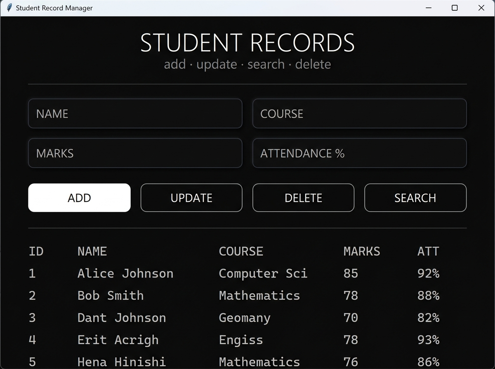

<h1 align="center">🎓 Student Record Management System</h1>

<p align="center">
  
  
  
  
  
</p>

<p align="center">
  A sleek, modern, <strong>dark-themed desktop application</strong> for managing student records — built with Python <code>Tkinter</code> and powered by a cloud-hosted <strong>Supabase PostgreSQL</strong> database.
</p>

<p align="center">
  <a href="https://github.com/rajishan2007-web/Student-Record-Management-System">⭐ Star this repo</a> ·
  <a href="https://github.com/rajishan2007-web/Student-Record-Management-System/issues">🐛 Report a Bug</a> ·
  <a href="https://github.com/rajishan2007-web/Student-Record-Management-System/fork">🍴 Fork it</a>
</p>

---

## 📸 Screenshot

<p align="center">
  
</p>

---

## 📖 About The Project

The **Student Record Management System (SRMS)** is a minimalist yet feature-rich desktop GUI application designed for educational institutions to efficiently manage student data.

Built entirely with Python's built-in `tkinter` library and connected to a **cloud PostgreSQL database via Supabase**, the system requires zero local database setup — simply run the script and the cloud database handles everything.

The interface is inspired by modern SaaS design principles — dark backgrounds, clean typography, subtle borders, and smooth animations — delivering a premium experience in a lightweight Python application.

---

## ✨ Features

| Feature | Description |
|---|---|
| ➕ **Add Student** | Insert new student records with name, course, marks & attendance |
| ✏️ **Update Student** | Edit any existing student record in real-time |
| 🗑️ **Delete Student** | Remove student records from the cloud database instantly |
| 🔍 **Live Search** | Filter students by name using case-insensitive `ILIKE` queries |
| 📋 **View All Records** | See all students in a clean, monospaced tabular list |
| 🌙 **Dark Theme UI** | Premium dark aesthetic with `#0c0c0c` background |
| ⚡ **Fade-in Animation** | Smooth window opacity transition on application launch |
| ☁️ **Cloud Database** | Persistent data via Supabase-hosted PostgreSQL — no local DB needed |
| 🔒 **SSL Connection** | Secure database connection with `sslmode=require` |
| 🖱️ **Click-to-Edit** | Click any record in the list to auto-populate the form fields |

---

## 🛠️ Tech Stack

| Layer | Technology | Purpose |
|---|---|---|
| **Language** | Python 3.x | Core application logic |
| **GUI** | Tkinter | Desktop UI framework |
| **Database** | PostgreSQL | Relational data storage |
| **Cloud Host** | Supabase | Managed PostgreSQL hosting |
| **DB Driver** | psycopg2-binary | PostgreSQL adapter for Python |

---

## 📋 Database Schema

The application **automatically creates** the `students` table on startup if it doesn't already exist — no manual setup required.

```sql
CREATE TABLE IF NOT EXISTS students (
    student_id  SERIAL PRIMARY KEY,
    name        VARCHAR(100),
    course      VARCHAR(50),
    marks       INT,
    attendance  INT
);
```

---

## 🚀 Getting Started

### Prerequisites

- Python 3.x installed on your system
- Internet connection (for Supabase cloud DB access)

### Installation & Run

**1. Clone the repository**
```bash
git clone https://github.com/rajishan2007-web/Student-Record-Management-System.git
cd Student-Record-Management-System
```

**2. Install dependencies**
```bash
pip install -r requirements.txt
```

**3. Launch the application**
```bash
python main.py
```

> ✅ That's it! The app connects to the cloud database automatically.

---

## 🗂️ Project Structure

```
Student-Record-Management-System/
│
├── main.py           # Main application file (UI + DB logic)
├── requirements.txt  # Python dependencies
├── screenshot.jpg    # Application screenshot
├── .gitignore        # Git ignore rules
└── README.md         # Project documentation
```

---

## 🎮 How to Use

| Action | Steps |
|---|---|
| **Add a student** | Fill in the form fields → Click **ADD** |
| **Update a record** | Click a record in the list → Edit fields → Click **UPDATE** |
| **Delete a record** | Click a record in the list → Click **DELETE** |
| **Search by name** | Type a name in the **NAME** field → Click **SEARCH** |
| **View all records** | Launch the app — records load automatically |

---

## 🔮 Future Improvements

- [ ] 📊 Analytics dashboard (average marks, attendance statistics)
- [ ] 📁 Export records to CSV / Excel
- [ ] 🔐 Login system with role-based access (admin/teacher)
- [ ] 🌐 Web version using Flask or FastAPI + React
- [ ] 📱 Cross-platform packaging (.exe for Windows, .app for Mac)
- [ ] 🎨 Theming support (light / dark toggle)

---

## 📜 License

This project is licensed under the **MIT License** — feel free to use, modify, and distribute it.

---

## 👤 Author

<p align="center">
  <strong>Made with ❤️ by <a href="https://github.com/rajishan2007-web">rajishan2007-web</a></strong>
</p>

<p align="center">
  <a href="https://github.com/rajishan2007-web">
    
  </a>
</p>

<p align="center">
  If you found this project useful, please consider giving it a ⭐ — it means a lot!
</p>

---

<p align="center">
  <sub>Built with Python · Tkinter · Supabase · PostgreSQL</sub>
</p>
